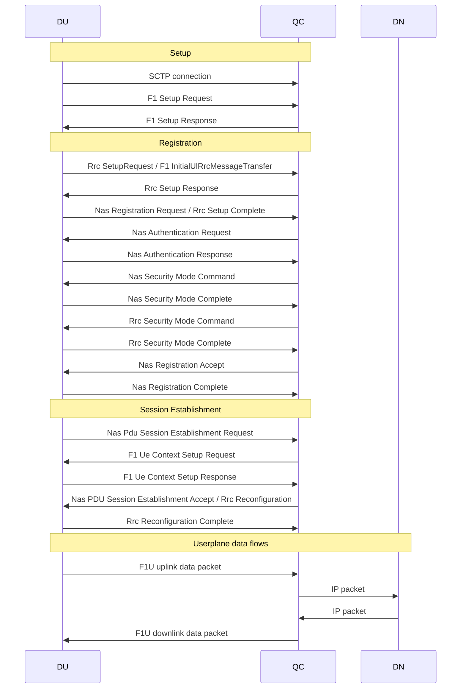

This is the mainline flow wherein a 5G UE connects to the RAN and 5G Core, sets up a PDU session.

The registration part of the procedure is implemented by InitialAccessProcedure::run() in [initial_access.rs](../../qcore/src/procedures/ue_procedures/initial_access.rs).

The session establishment part of the procedure is implemented by PduSessionEstablishmentProcedure::run() in [pdu_session_establishment.rs](../../qcore/src/procedures/ue_procedures/pdu_session_establishment.rs).

The following are assumed: Rrc DlInformationTransfer / F1 DlRrcMessageTransfer; Rrc UlInformationTransfer / F1 UlRrcMessageTransfer.
