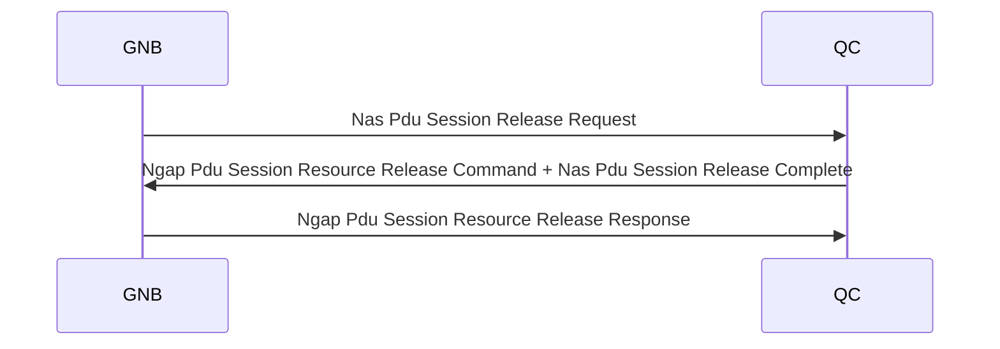
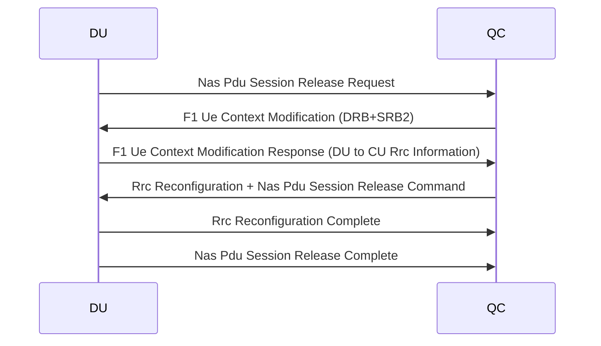

When releasing a PDU session, we first update the UE via Rrc Reconfiguration and then modify the F1 context to 
delete SRB2 and DRB 1.

## NGAP mode

srsRAN does DU first and doesn't bundle rrc 

## F1AP mode

