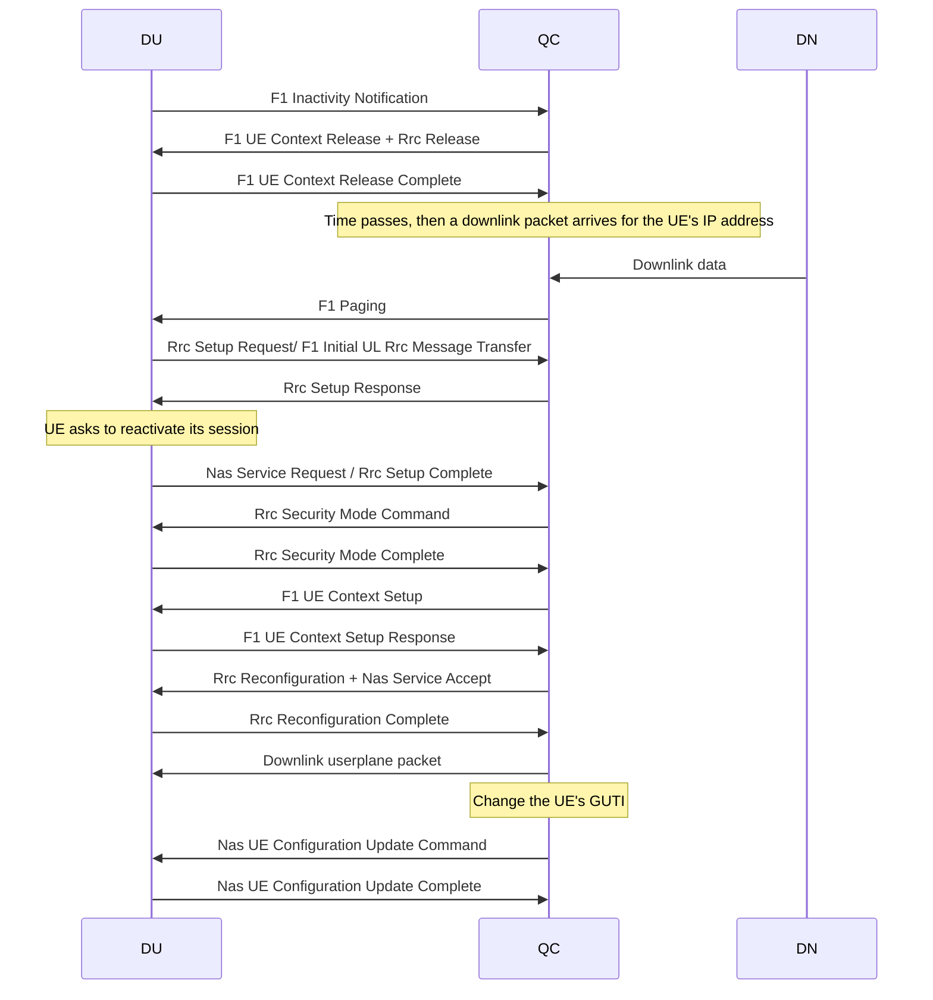

# RRC IDLE Paging
This is the sequence for handling downlink data while the UE is in RRC IDLE.  The starting point is a registered, connected UE with an established PDU session.  
-  First the UE is put into IDLE state via an Rrc Release (because DU detects user inactivity on SRB2 + DRB1).  
-  A downlink packet arrives for it.  
-  QCore pages the UE using the UE's 5G-S-TMSI.  
-  The UE sets up Rrc and reactivates its PDU session via a NAS Service Request.
-  QCore sends it the packet that triggered the paging.
-  Finally, QCore is meant to change the UE's GUTI as part of a network triggered service request (for
anti-snooping reasons).

TBD as separate designs: 
- RRC INACTIVE
- RRC IDLE where the UE has no SRB2/DRB1/IP address.

## Sources for the above
- AN Release procedure - TS23.501, 4.2.6
- Rrc Release - TS38.331, 5.3.8
- Rrc Paging - TS38.331, 5.3.2
- Network Triggered Service Request - TS23.502, 4.2.3.3
- UE Triggered Service Request - TS23.502, 4.2.3.2

## Security contexts
In QCore, the Nas and Rrc security contexts are initially created in the context of a UE CU F1AP ID.  However, upon transition to idle, this ID is destroyed.  Following the resume, the GUTI/S-TMSI in the Nas Service Request identifies the Nas security context.

The Nas Service Request is sent in the clear (so that it can convey the S-TMSI in the clear), but can embed a second encrypted Nas message.
This is known as an 'initial Nas message' - see TS33.501, 6.4.6.  "If the UE has a Nas security context, the message sent shall contain the information given above in cleartext and the complete initial Nas message ciphered in a Nas container which is ciphered. With a Nas security context, the sent message shall also be integrity protected. " 

## Notes for RRC Inactive
- Rrc Connected to Rrc Inactive - TS38.401, 8.6.1
- Rrc Inactive to other states - TS38.401, 8.6.2

Following the resume, the C-RNTI identifies the Rrc security context used for the Rrc Resume Request.  The Rrc Resume Request contains a 'resume identity' (RNTI) and 'resume MAC' which refer to its previous Rrc security context.  The F1 UL Rrc Message Transfer also carries the RNTI.
